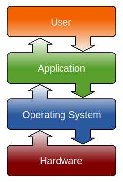
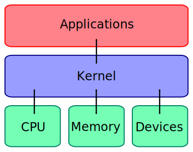
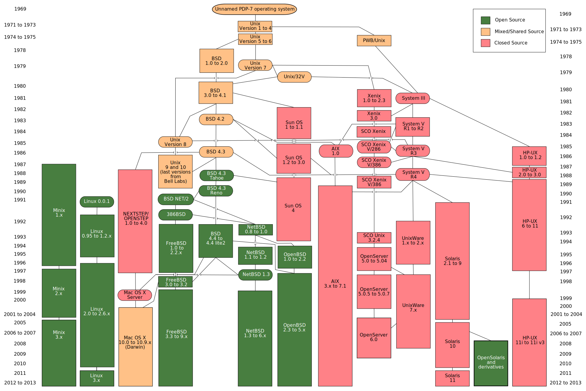
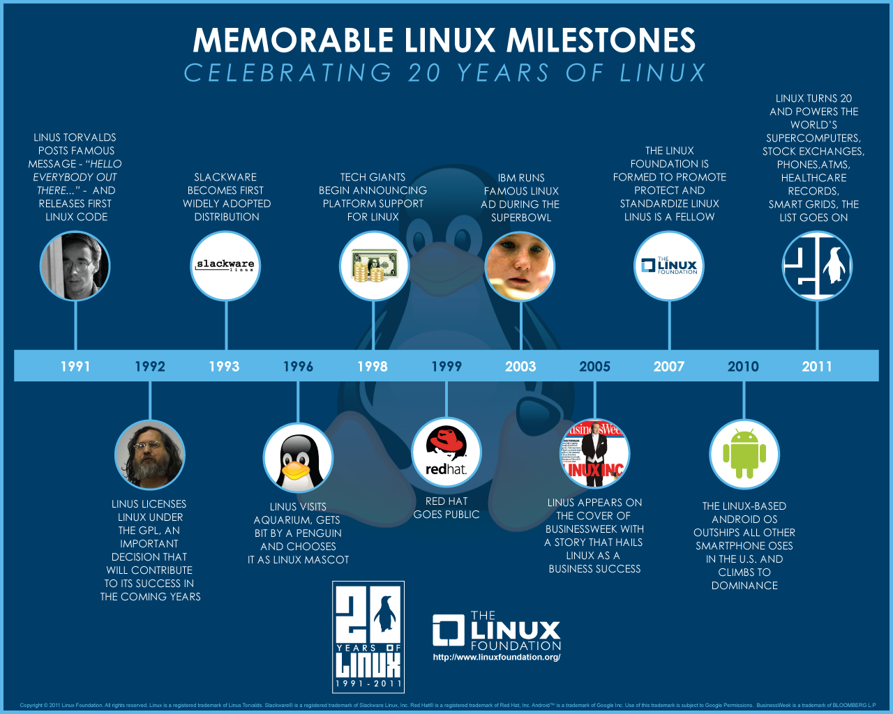
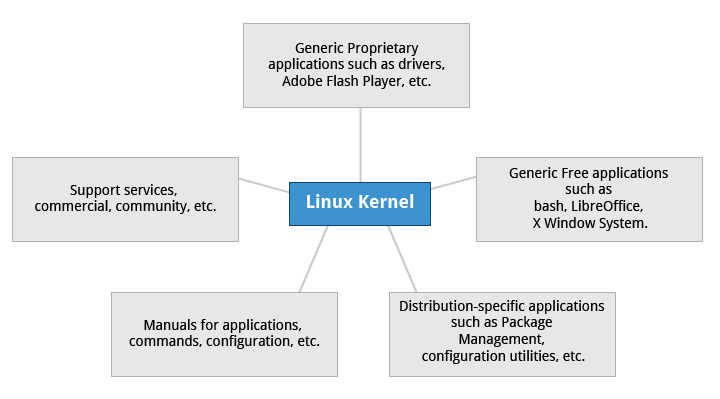
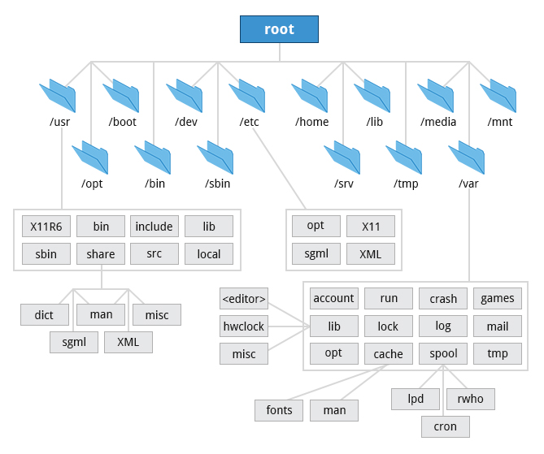
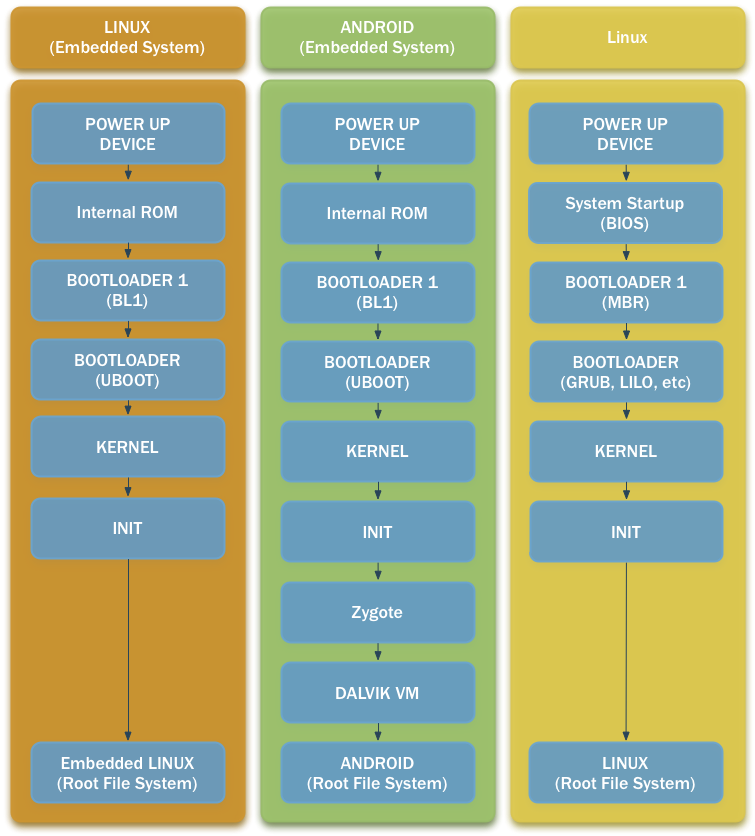
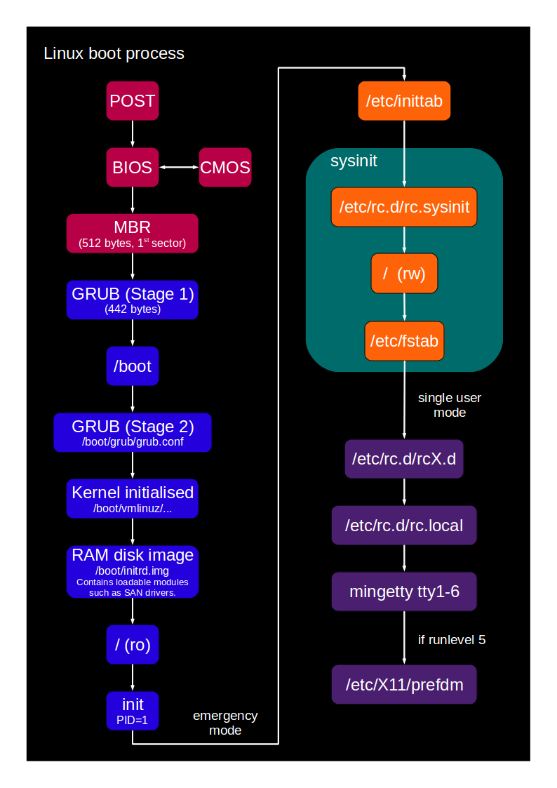

% Introduction
% SEIE, Soochow University
% Week 01, 2016-2017-1

# Why Linux

# [Takahashi](https://en.wikipedia.org/wiki/Takahashi_method)

# 髙橋流

# 大

# 多

# 快

# 很快

# 非常快

# 听

# Why Linux

## *Embedded* is NOT Embedded

* Embedded System
    - Closely integrated with the main system

* Hardware and Software

* What about micro-controller systems?
    - single program/application
        + OS merged with or without OS

## Embedded Operating System

* Adapting an Existing OS
* Purpose-Built Embedded OS

## What is OS?

. . .

Manages computer hardware and software resources

. . .

Provides common services for computer programs

---

## Linux

### An Unix-like OS
### mostly POSIX-compliant

# History

---

---

## About Licenses

---

# Linux Operating System

---

---

## Linux distro

Linux distribution

. . .

an operating system made as a software collection based on the Linux kernel

. . .

More than 600 distros, Any one could make

## Well-known Ones

> * Community Support & Services
>     - Arch
>     - Debian
>     - Fedora
>     - CentOS
>     - Gentoo
>     - openSUSE

---

> * Commercial Support & Services
>     - Ubuntu
>     - RHEL
>     - Oracle
>     - SLES
>     - Chrome OS
>     - Android

## Filesystem Hierarchy Standard

## Boot Process

---

---

# Learning and Grading

## Role Growing Path

* User
* Power User
* Administrator
* Developer

## Scores and Credits

* Lab tasks 40%
* Technical Writings 40%
* Discussion and Review 20%

## How To

* References
* Try it Yourself
* Principle Understanding
* Labs
* All activities on Linux 
    * documents, games, recreation, developments ...

# 全真

# Tools

# 沉浸 (flow)

---

---

---

---

---

# Issue

# Wiki

# repo. (repository)

# fork

# [GFM](https://help.github.com/articles/basic-writing-and-formatting-syntax/)

# 任务

# 节奏

# coach

# 促

# 馈

# trust/faith

# commitment

# Outcome

## Output

* 提取
* 反编译
* 作品

## Desirable Difficulties

* 合意困难
* 阻滞

## Problem Solving

以最小代价解决问题！

## Information Source

* Official documents
* Source language

## 笔记/教程写作

> * 背景-目标-尝试-改进-经验-问题-期望-进展-参考
> * [教程应该怎么写？](https://github.com/su-da/notes/wiki/%E6%95%99%E7%A8%8B%E5%BA%94%E8%AF%A5%E6%80%8E%E4%B9%88%E5%86%99%EF%BC%9F)
> * [对所有学员的唯一要求](https://github.com/su-da/notes/wiki/%E5%AF%B9%E6%89%80%E6%9C%89%E5%AD%A6%E5%91%98%E7%9A%84%E5%94%AF%E4%B8%80%E8%A6%81%E6%B1%82)

## Issue 提问和讨论

> * 现象 分析 问题 方案 文化 进展
> * 重现性/重复性
> * [提问的智慧](https://lug.ustc.edu.cn/newwiki/doc/smart-questions)
> * [提问的智慧](https://lug.ustc.edu.cn/wiki/doc/smart-questions) 长版

# 本周任务

## 安装

> * VMWare Workstation / VirtualBox / Hyper-V
> * Linux (Ubuntu, Debian, Fedora, CentOS, Linux for windows ...)
> * Applications / Tools
> * Daily use

## 网络社区

> * 注册 [github](https://github.com)
> * fork https://github.com/su-da/notes
> * 使用 github 账户登录 [gitbook](https://gitbook.com)
> * gitbook 中新建 book，选择导入 GITHUB
> * 访问 [su-da/linux-cw](https://github.com/su-da/linux-cw)，点击 Watch
> * 到 Issues 下面，回复 [报到] 那个 issue 报上自己的信息
> * 开始在 gitbook 上写作
