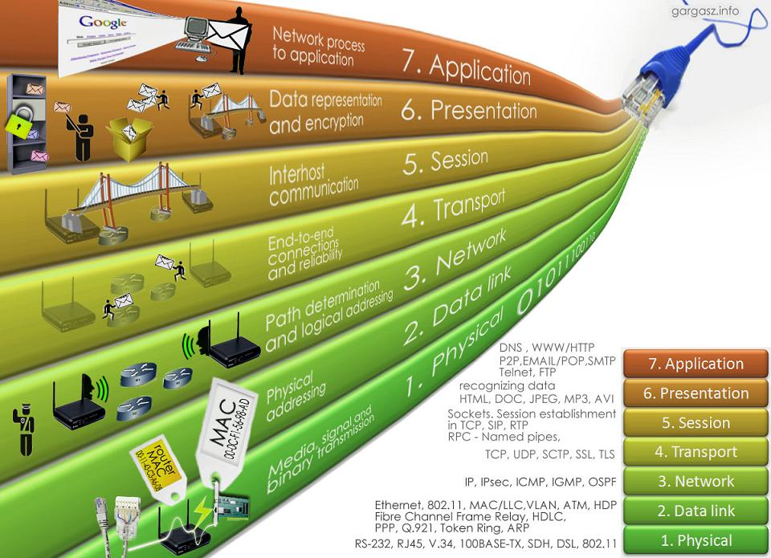
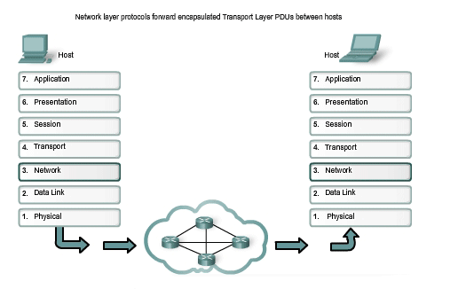
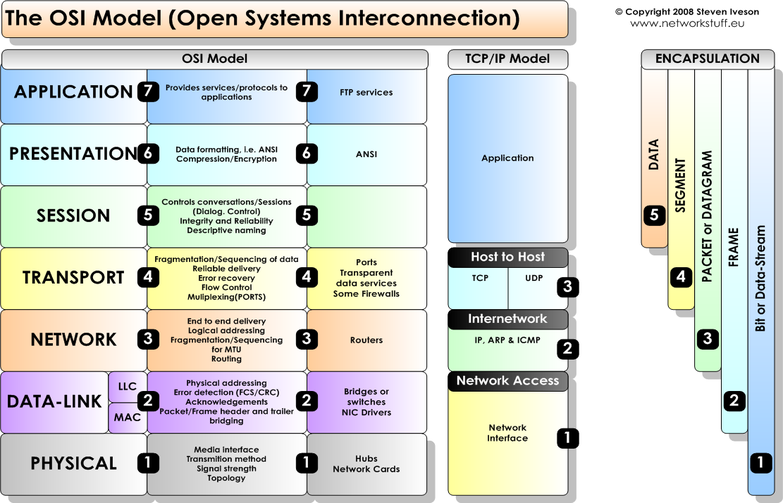

% CLI Related Concepts
% SEIE, Soochow University
% Week 07, 2015-2016-1

# Networking

## Network Layer



---



---



## Layer Addressing

*   Ports
*   IP (Internet Protocol) Addresses
*   MAC

---

MAC

`84:18:88:9e:20:a6`

## IPv4 and IPv6

* IPv4: 32-bits
* IPv6: 128-bits

. . .

```
IP address ->        172  .    16  .    31  .      46
Bit format ->     10101100.00010000.00011111.00101110
netmask    ->        255  .    255 .   254  .      0
CID form   ->       172.16.31.46/23
```

. . .

```
2001:da8:100a:43::2a/64
```

## IP Address Allocation

*   static/Manual
*   Automatic
    -   DHCP or DHCPv6
    -   stateless autoconfiguration
*   link local
    -   169.254.0.0/16
    -   fe80::/64

## Name Resolution

*   Domain Name to IP address
*   Domain Name System (DNS)
*   Client utils: `host` and `dig`; `/etc/resolv.conf`

## Network Interfaces

*   List network interface card (NIC) info: `ifconfig`
*   Linux `ip` utilties: `ip link`; `ip addr`; `ip route` ...
*   `ping`
*   `route`; `traceroute`
*   `netstat`

## Network Applications

*   `wget`; `curl`
*   `ssh`; `scp`

# Hash function

## Hash function

*   Function to map any size data to data of fixed size
*   Return hashes/hash values/hash sums
*   Search; Data integrity; Cryptography
*   checksums, fingerprints

## Cryptographic hash function

*   one-way Hash functions
*   Practically impossible to invert, get input data from hashes
*   Hashes uniquely identifies original data: fingerprint

## Common hash functions

*   *MD5*
*   *SHA-1*
*   SHA-256; SHA-512
*   SHA-224; SHA-384

# Backus-Naur Form

---

    ls [OPTION]... [FILE]...
    host [-aCdlnrsTwv] [-c class] [-N ndots] [-R number] [-t type]
            [-W wait] [-m flag] [-4] [-6] {name} [server]
    stone [-C <file>] [-P <command>] [-Q <options>] [-N] [-d] [-p] [-n]
	      [-u <max>] [-f <n>] [-l] [-L <file>] [-a <file>] [-i <file>]
	      [-X <n>] [-T <n>] [-A <n>] [-r]
	      [-x <port>[,<port>][-<port>]... <xhost>... --]
	      [-s <send> <expect>... --]
	      [-b [<var>=<val>]... <n> <master>:<port> <backup>:<port>]
	      [-B <host>:<port> <host1>:<port1>... --]
	      [-I <host>]
	      [-o <n>] [-g <n>] [-t <dir>] [-D] [-c <dir>]
	      [-q <SSL>] [-z <SSL>]
	      [-M install <name>] [-M remove <name>]
	      <st> [-- <st>]...   

## BNF

*   Notation techniques to describe syntax
*   Extended Backus-Naur Form (EBNF), ISO/IEC 14977
*   [BNF and EBNF](res/BNF.pdf)

# Regular Expression

## Regular Expression

Sequence of characters define a search pattern, string matching.

Found in text editors, text processing utilities and programming languages.

*   `^[ \t]+|[ \t]+$`
*   `^[+-]?(\d+(\.\d+)?|\.\d+)([eE][+-]?\d+)?$`
*   IEEE POSIX standard: BRE (Basic), ERE (Extended)
*   PCRE (Perl Compatible Regular Expressions)
*   [Regular Expressions](res/regex.pdf)
