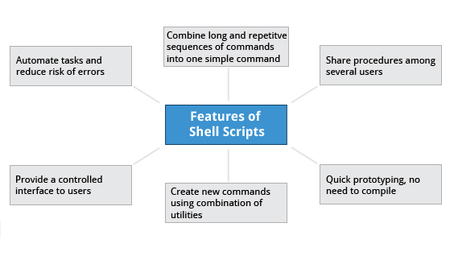
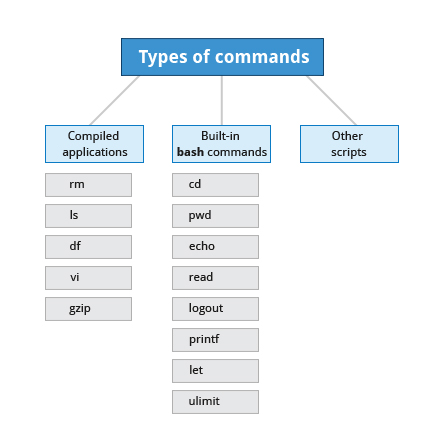

% sh/bash scripting
% SEIE, Soochow University
% Week 09, 2015-2016-1



---

*   Scripts requirs an interpreter
*   File: the first line starts with `#!`
    
    ```bash
    #!/bin/bash
    ls | more
    ```

## Shell interpreters

    /bin/sh
    /bin/bash
    /bin/tcsh
    /bin/csh
    /bin/ksh
    /usr/bin/perl
    /usr/bin/python

---

`vim testsh.sh`

```bash
#!/bin/sh
echo "HELLO"
echo "WORLD"
```

. . .

`bash testsh.sh`

. . .

    chmod +x testsh.sh
    ./testsh.sh

## Interactive scripts

`#` starts comments

```bash
#!/bin/sh
# Interactive reading of variables
echo "ENTER YOUR NAME"
read sname
# Display of variable values
echo $sname
```

## Return Values

*   0 for success; none-zero for failure.
*   the last retune value in environment variable `$?`
*   return by `exit` statement in shell.

# Syntax

## Special character in bash

Character   Description
----------  ------------
`#`         comment, except: `\#` and `#!`
`\`         continuation on to the next line
`;`         following is a new command
`$`         indicates a variable

## Comments

```bash
# This line will not get executed.
```

## Long Lines

```
scp abc@server1.linux.com:\
/var/ftp/pub/userdata/custdata/read \
abc@server3.linux.co.in:\
/opt/oradba/master/abc/
```

. . .

What is a line?

## Multiple Commands on a Single Line

```
make ; make install ; make clean
```

. . .

    make && make install && make clean

Abort if one fails

. . .

    cat file1 || cat file2 || cat file3

If something succeeds, then stop executing any further steps.

## Functions

```bash
function_name () {
   command...
}
```

. . .

```bash
#!/bin/sh
display() {
    echo "This is the message from the function"
    echo "The parameter passed from calling process is" $1
}
display "Bob"
display "Rambo"
display "Bond"
```

## Built-in Shell Commands

`type`, `man bash` or `help`



## Command Substitution

> * enclosing inner command with `` ` ``
> * or `$( )`
> * launch a new shell, standard out inserted in the place

. . .

~~~bash
echo cd /lib/modules/$(uname -r)/
echo cd /lib/modules/`uname -r`/
cd /lib/modules/$(uname -r)/
$(echo cd /lib/modules/$(uname -r)/)
~~~

## Environment Variables

*   Referencing or using:  prefix with `$`. e.g. `echo $PATH`
*   When setting, no `$` prefix

    `MYCOLOR=blue; echo $MYCOLOR`

*   To make usable by child processes (sub-shells)

    `export VAR=value` or `VAR=value ; export VAR`

    copied to child process without copy back.

## Script Parameters

```
./script.sh /tmp
./script.sh 100 200
```

. . .

Parameter   Meaning
----------- --------
`$0`        Script name
`$1`        First parameter
`$2, $3`... Second, third parameter, ...
`$*`        All parameters in a string
`$#`        Number of arguments
`$@`        All parameters in a set

---

```bash
#!/bin/sh
echo "The name of this program is: $0"
echo "The first argument passed from the command line is: $1"
echo "The second argument passed from the command line is: $2"
echo "The third argument passed from the command line is: $3"
echo "All of the arguments passed from the command line are : $*"
echo
echo "All done with $0"
```

## I/O Redirection

*   `>`, `>>`, `<`
*   `free > /tmp/free.out`
*   `free >> /tmp/free.out`
*   `wc -l < /temp/free.out`

# Constructs

## The if Statement

`if TEST-COMMANDS; then CONSEQUENT-COMMANDS; fi`

```bash
if condition
then
       statements
else
       statements
fi
```

---

```bash
if [ -f /etc/passwd ] ; then
    echo "/etc/passwd exists."
fi
```

. . .

`[[ -f /etc/passwd ]]` or `(( -f /etc/passwd ))`

## Testing for Files

Condition   Meaning
----------  --------
`-e file`   Check if the file exists.
`-d file`   Check if the file is a directory.
`-f file`   Check if the file is a regular file (not symbolic link, device node, directory, etc.)
`-s file`   Check if the file is of non-zero size.
`-g file`   Check if the file has sgid set.
`-u file`   Check if the file has suid set.
`-r file`   Check if the file is readable.
`-w file`   Check if the file is writable.
`-x file`   Check if the file is executable.

`man 1 test`

---

String Testing

```bash
if [ string1 == string2 ] ; then
   ACTION
fi
```

## Numerical Tests

Operator    Meaning
---------   --------
`-eq`       Equal to
`-ne`       Not equal to
`-gt`       Greater than
`-lt`       Less than
`-ge`       Greater than or equal to
`-le`       Less than or equal to

---

```bash
#!/bin/sh
# Prompt for a user name...
echo "Please enter your age:"
read AGE
if [ "$AGE" -lt 20 ] || [ "$AGE" -ge 50 ] ; then
    echo "Sorry, you are out of the age range."
elif [ "$AGE" -ge 20 ] && [ "$AGE" -lt 30 ] ; then
    echo "You are in your 20s"
elif [ "$AGE" -ge 30 ] && [ "$AGE" -lt 40 ] ; then
    echo "You are in your 30s"
elif [ "$AGE" -ge 40 ] && [ "$AGE" -lt 50 ] ; then
    echo "You are in your 40s"
fi
```

## Arithmetic Expressions

*   `$((...))`

    `echo $((x+1))`

*   built-in shell command `let`

    `let x=( 1 + 2 ); echo $x`

*   `var=$((...))`

    `x=$((1+2)); echo $x`

## String Operators

Operator                    Meaning
---------                   --------
`[[ string1 > string2 ]]`   Compares the sorting order
`[[ string1 == string2 ]]`  Compares the characters
`myLen1=${#string1}`        Saves the length of string1 in the variable myLen1.

## Parts of a String

```bash
name="bagend.hobbiton.com"; echo $name
loco=${name:0:6}; echo $loco
moto=${name#*.}; echo $moto
```

## Boolean Expressions

evaluate to either **TRUE** or __FALSE__

Operator    Operation
---------   ----------
`&&`        AND
`||`        OR
`!`         NOT

## Case Statement

```bash
case expression in
   pattern1) execute commands;;
   pattern2) execute commands;;
   pattern3) execute commands;;
   pattern4) execute commands;;
   * )       execute some default commands or nothing ;;
esac
```

---

```bash
#!/bin/sh
# Prompt user to enter a character
echo "Please enter a letter:"
read charac
case "$charac" in
    "a"|"A") echo "You have typed a vowel!" ;;
    "e"|"E") echo "You have typed a vowel!" ;;
    "i"|"I") echo "You have typed a vowel!" ;;
    "o"|"O") echo "You have typed a vowel!" ;;
    "u"|"U") echo "You have typed a vowel!" ;;
    *)       echo "You have typed a consonant!" ;;
esac
exit 0
```

# Looping Constructs

*   `for`
*   `while`
*   `until`

## `for` Loop

```bash
for variable-name in list
do
    execute one iteration for each item in the
            list until the list is finished
done
```

---

```bash
#!/bin/sh
#
sum=0
for i in 1 2 3 4
do
    sum=$(($sum+$i))
done
echo "The sum of $i numbers is: $sum"
```

## `while` Loop

```bash
#!/bin/sh
#
echo "Enter the number"
read no
fact=1
i=1
while [ $i -le $no ]
do
    fact=$(($fact * $i))
    i=$(($i + 1))
done
echo "The factorial of $no is $fact"
```

## `until` Loop

```bash
#!/bin/sh
echo "odd NUMBER under 10"
mn=1
mx=10
until [ $mn -gt $mx ]
do
    echo "$mn"
    mn=$(($mn + 2))
done
```

# Debugging

## Debug Mode

*   run in debug mode ` bash -x script_file`

    traces, prefixes commands with `+`, displays them.

*   Partial debugging

    ```bash
    set -x # turns on debugging
    ...
    set +x # turns off debugging
    ```

## Redirecting Errors

File stream File Descriptor
----------- ----------------
stdin       0
stdout      1
stderr      2

`bash sample.sh 2> error.txt`

# More tutorials

## See

[Bash Programming](res/bash-pgming.pdf)

[UNIX Shell Scripting Basics](res/UNIX-Shell-Scripting-Basics.pptx)
